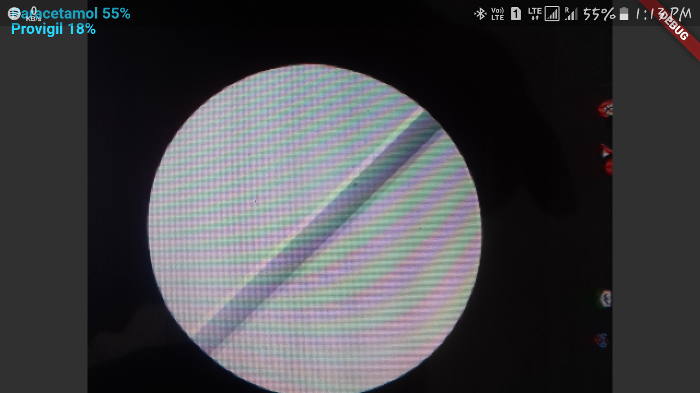

# PicToPill

Real-time Pill classification App in Flutter using [camera](https://pub.dartlang.org/packages/camera) and [tflite](https://pub.dartlang.org/packages/tflite) plugin. 

## Install 

```
flutter packages get
```

## Run

```
flutter run
```

## Models

- Image Classification
  - PillNet

## Previews
 

